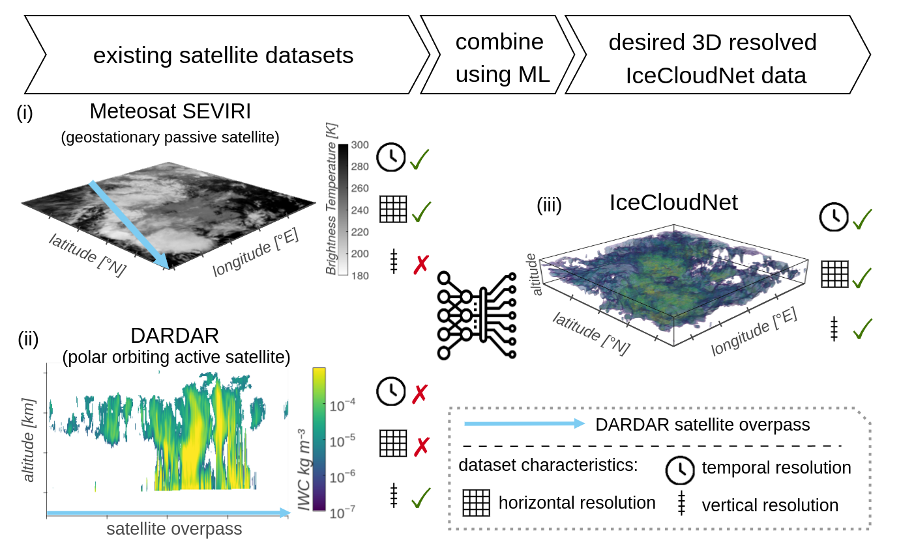
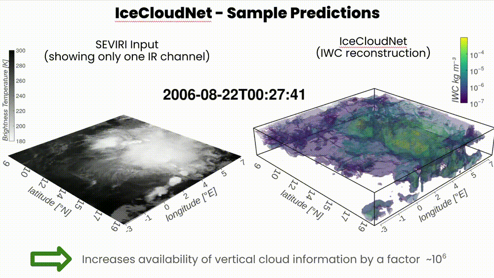

# IceCloudNet

Clouds containing ice remain a source of great uncertainty in climate models and future climate projections. IceCloudNet overcomes the limitations of existing satellite observations and fuses the strengths of high spatio-temporal resolution of geostationary satellite data with the high vertical resolution of active satellite retrievals through machine learning. With this work we are providing the research community with a fully temporal and spatial resolved 4D dataset of cloud ice properties enabling novel research ranging from cloud formation and development to the validation of high-resolution weather and climate model simulations.

## Inference 

This repo contains a pretrained model that can be used to create 3D cloud structures from MeteoSat Seviri input.

Steps:
* Download SEVIRI input data: `src/download_data/MSG_eunmdac_satpy.ipynb`
* Unzip with `src/unzip_seviri.sh`
* Create input data for ML model: `src/inference/CreateSeviriWholeAreaTimeSeries.ipynb`
* Specify `DATA_DIR` variable in `src/inference.py` and set up directory structure as described there
    * mv `helper_files/*  DATA_DIR`
* Run inference: `run_inference.sh`

## Training

### Download input data

Steps:
* Download SEVIRI input data: `src/download_data/MSG_eunmdac_satpy.ipynb`
* Unzip with `src/unzip_seviri.sh`
* Download DARDAR-Nice from [ICARE data servers](earlier version: https://www.icare.univ-lille.fr/data-access/data-archive-access/?dir=CLOUDSAT/DARDAR-NICE_L2-PRO.v1.00/) → login required. 
    * Currently only DARDAR Nice v1 available on ICARE. Contact the author for v2 (which is used in the paper).

### Pre process and Co-locate SEVIRI and DARDAR-Nice

run `python data_preproc.py YYYYMMDD YYYYMMDD n_workers

### Run experiment

We are using [Comet ML](https://www.comet.com/) to track experiments. Setup up account and insert your credentials in the necessary places. Setup up environ variables alternatively.

Steps: 
* mv `helper_files/*  /path/to/your/data/directory`
* specify filepaths in `run_experiment.py` and then run 

## Evaluation

